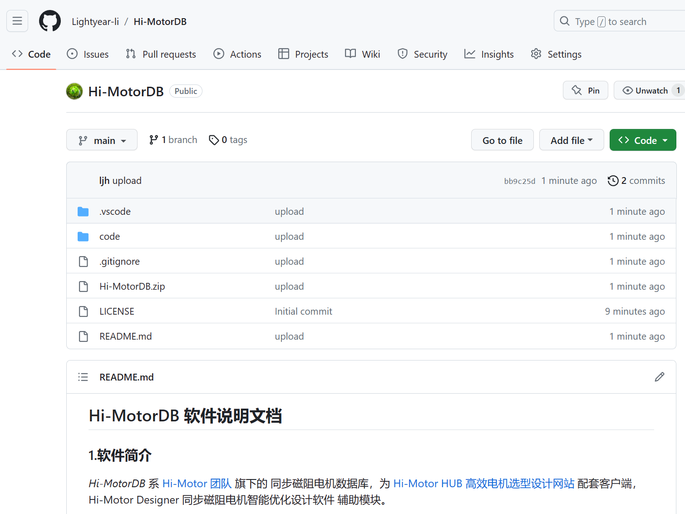

## 
 Hi-MotorDB 软件说明文档

### 1.软件简介

*Hi-MotorDB* 系 [Hi-Motor 团队](www.hi-motor.site) 旗下的 同步磁阻电机数据库，为 [Hi-Motor HUB 高效电机选型设计网站](https://hub.hi-motor.site) 配套客户端， <label style="color:#0097db">Hi-Motor Designer 同步磁阻电机智能优化设计软件</label> 辅助模块。

本软件由Hi-Motor团队成员李俊昊，华中科技大学电气与电子工程学院电气2102班学生，藉学院软件工程训练营之际，以巩固数据库相关知识为目标，于2023年8月独立编写。

### 2.软件概要

> 软件环境：Window 7 及以上版本
> 硬件环境：PC CPU 1GHz 内存 1GB 硬盘 10GB
> 开发语言：Python 3.8
> 开发工具：Microsoft VSCode 1.74.2
> 数 据 库：SQLite 3.31.1
> GUI&emsp;&emsp;：PyQt5 5.15.4

### 3.安装流程

##### 3.1 从Github获取软件资源
本软件在Github上开源 <u>[点击此处获取软件资源](https://github.com/Lightyear-li/Hi-MotorDB)</u>
