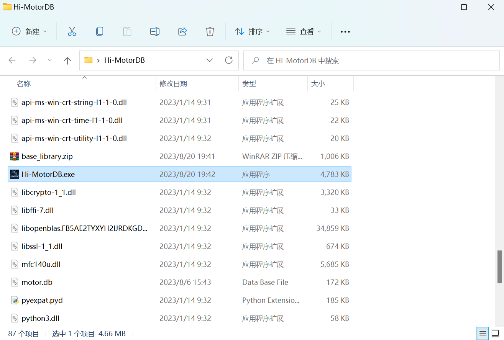
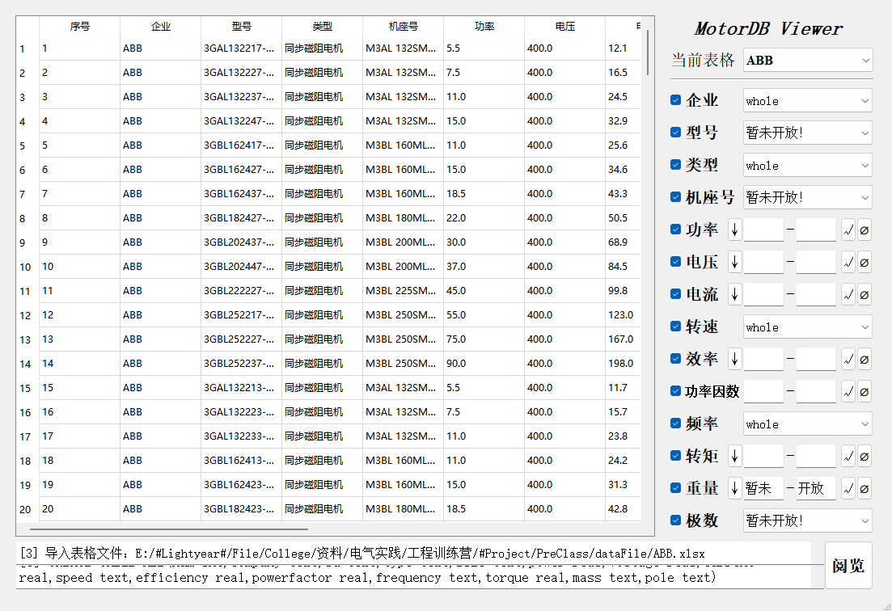
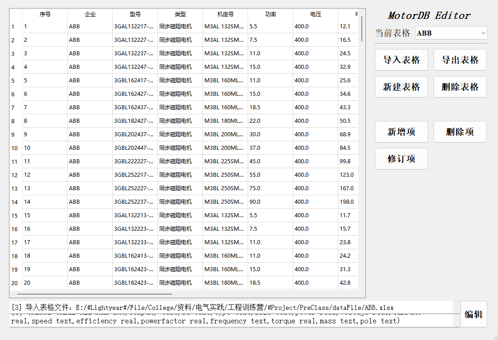

## <center> Hi-MotorDB 软件说明文档 </center>

### 1. 软件简介

Hi-MotorDB 系 Hi-Motor 团队旗下的同步磁阻电机数据库，为 Hi-Motor HUB 高效电机选型设计网站配套客户端，Hi-Motor Designer同步磁阻电机智能优化设计软件辅助模块。

本软件由Hi-Motor团队成员李俊昊，华中科技大学电气与电子工程学院电气2102班学生，藉学院软件工程训练营之际，以巩固数据库相关知识为目标，于2023年8月独立编写。

<br />友情链接：

<u>[Hi-Motor 团队](www.hi-motor.site)</u>

<u>[Hi-Motor HUB 高效电机选型设计网站](https://hub.hi-motor.site)</u>

<label style="color:#0097db"><u>Hi-Motor Designer 同步磁阻电机智能优化设计软件</u></label>（维护中）

<br />

### 2. 软件概要

> 软件环境：Window 7 及以上版本
> 
> 硬件环境：PC&emsp;CPU 1GHz&emsp;内存 1GB&emsp;硬盘 10GB
> 
> 开发语言：Python 3.8
> 
> 开发工具：Microsoft VSCode 1.74.2
> 
> 数 据 库：SQLite 3.31.1
> 
> GUI&emsp;&emsp;：PyQt5 5.15.4

<br />

### 3. 软件安装流程

##### 3.1 从Github获取软件资源
本软件在 Github 上开源，*License GUN GPL 3.0* &emsp;<u>[点击此处获取软件资源](https://github.com/Lightyear-li/Hi-MotorDB/releases/tag/Realease)</u>
<center>  </center>
<center>  </center>
<center> Github 软件资源 </center>

##### 3.2 获取软件应用程序
点击 <u>**_Hi-MotorDB.zip_**</u> 下载软件应用程序压缩包，双击 <u>**_Hi-MotorDB.exe_**</u> 直接使用软件。
<center>  </center>
<center> Hi-MotorDB 软件目录 </center>

##### 3.3 获取软件源代码
点击 <u>**_Sourse code (zip)_**</u> 下载软件源代码压缩包，

软件调试需要使用 PyQt5 与 openpyxl 库，需要使用者进行相应的安装。
```
# 打开终端，依次输入
pip install PyQt5
pip install openpyxl
```
本软件源代码目录下提供了 `requirements.txt` 依赖文本，在终端输入 `pip install -r requirements.txt` 亦可完成安装。

<br />

### 4. 软件使用说明

##### 4.1 Hi-MotorDB Viewer 数据库阅览器
<center>  </center>
<center> Hi-MotorDB Viewer </center>
<br />
Hi-MotorDB Viewer 数据库阅览器提供了高效电机数据库的可视化阅览功能，支持排序、筛选等功能。

- 点击 进行数据排序，点击恢复默认排序
- 点击下拉框筛选文字类数据，在编辑框中键入最大值与最小值，点击筛选数值类数据，点击重置该项筛选
- 目前由于没有测试数据，暂未开放 “重量” 与 “极数” 筛选功能
##### 4.2 Hi-MotorDB Editor 数据库编辑器
<center>  </center>
<center> Hi-MotorDB Editor </center>

