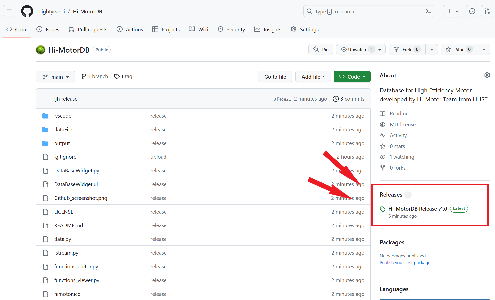

# <center> Hi-MotorDB 软件说明文档 </center>

 &emsp;  &emsp;  &emsp; 

## 1. 软件简介

Hi-MotorDB 系 Hi-Motor 团队旗下的同步磁阻电机数据库，为 Hi-Motor HUB 高效电机选型设计网站配套客户端，Hi-Motor Designer 同步磁阻电机智能优化设计软件辅助模块。

本软件由 Hi-Motor 团队成员李俊昊，华中科技大学电气与电子工程学院电气2102班学生，藉学院软件工程训练营之际，以巩固数据库相关知识为目标，于2023年8月独立编写。

<br />友情链接：

<u>[Hi-Motor 团队](www.hi-motor.site)</u>

<u>[Hi-Motor HUB 高效电机选型设计网站](https://hub.hi-motor.site)</u>

<u>[Hi-Motor Designer 同步磁阻电机智能优化设计软件](www.hi-motor.site)</u>（维护中）

<br />

## 2. 软件概要

> 软件环境：Window 7 及以上版本
> 
> 硬件环境：PC&emsp;CPU 1GHz&emsp;内存 1GB&emsp;硬盘 10GB
> 
> 开发语言：Python 3.8
> 
> 开发工具：Microsoft VSCode 1.74.2
> 
> 数 据 库 ：SQLite 3.31.1
> 
> GUI&emsp;&emsp;：PyQt5 5.15.4

<br />

## 3. 软件安装流程

### 3.1 从Github获取软件资源
本软件在 Github 上开源，<u>**_License GUN GPL 3.0_**</u> &emsp;<u>[点击此处获取软件资源](https://github.com/Lightyear-li/Hi-MotorDB/releases/tag/Realease)</u>
<center>  </center>
<center>  </center>

### 3.2 获取软件应用程序
点击 <u>**_Hi-MotorDB.zip_**</u> 下载软件应用程序压缩包，双击 <u>**_Hi-MotorDB.exe_**</u> 直接使用软件。
<center>  </center>

### 3.3 获取软件源代码
点击 <u>**_Sourse code (zip)_**</u> 下载软件源代码压缩包，

软件调试需要使用 PyQt5 与 openpyxl 库，需要使用者进行相应的安装。打开终端，依次输入：
```
pip install PyQt5
pip install openpyxl
```
本软件源代码目录下提供了 `requirements.txt` 依赖文本，在终端输入 `pip install -r requirements.txt` 亦可完成安装。

<br />

## 4. 软件使用说明

点击软件界面右下角 **`"阅览"`**/**`"编辑"`** ，在 **Hi-MotorDB Viewer** 与 **Hi-MotorDB Editor** 之间进行切换。

### 4.1 Hi-MotorDB Viewer 数据库阅览器
<center>  </center>
<br />
Hi-MotorDB Viewer 数据库阅览器提供了高效电机数据库的可视化阅览功能，支持排序、筛选等功能。

- 点击 **`↑`** **`↓`** 进行数据排序，点击 **`⌀`** 恢复默认排序
- 点击下拉框  筛选文字类数据，在编辑框  中键入最大值与最小值，点击 **`√`** 筛选数值类数据，点击 **`⌀`** 重置该项筛选
- 目前由于没有测试数据，暂未开放 “重量” 与 “极数” 筛选功能

<br />

### 4.2 Hi-MotorDB Editor 数据库编辑器
<center>  </center>
<br />
Hi-MotorDB Editor 数据库编辑器提供了高效电机数据库的可视化编辑功能，支持对数据库导入、导出、增、删、改等功能。

- 点击 **`"导入表格"`** ，导入外部xlsx文档，按照文档内容创建新的数据库表格并完成对应数据添加。
- 点击 **`"导出表格"`** ，在对话框中选择需要导出的表格，可选择全部表格导出或单个表格导出，点击 **`"确认导出表格"`** 导出数据库表格。
- 点击 **`"新建表格"`** ，在对话框中输入表格名称，点击 **`"创建新表格"`** 创建新的空白数据库表格。
- 点击 **`"删除表格"`** ，在对话框中选择需要删除的表格名称，点击 **`"确认删除表格"`** 完成表格删除。
- 点击 **`"新增项"`** ，在对话框中输入对应数据，点击 **`"确认新增数据项"`** 完成数据项增添。
- 点击 **`"删除项"`** ，在对话框中输入需要删除的数据对应序号，点击 **`"确认删除数据项"`** 完成数据项删除。
- 点击 **`"修订项"`** ，在对话框中输入对应数据，点击 **`"查询项"`** 获取数据项内容，根据需要修改数据项内容，点击 **`"确认修订数据项"`** 完成数据项修订。

<br />

## 5.软件API详解

外置库 `PyQt5`、`openxlsx`、`sqlite` 所提供的API本文不再进行阐述。

### 5.1 类方法

#### >> 5.1.1 Ui_MainWindow 类及其方法
``` python
class Ui_MainWindow(object):
    def setupUi(self, MainWindow):···
    def retranslateUi(self, MainWindow):···
```
`Ui_MainWindow(object)`为GUI界面类，由Pyuic自动生成，包含`setupUi(self, MainWindow)`与`retranslateUi(self, MainWindow)`两个方法。`setupUi()`为GUI界面控件的完整定义`retranslateUi()`为GUI界面内中文文本的翻译设置。

#### >> 5.1.2 Imports 类及其方法
``` python
class Imports(QtWidgets.QMainWindow, Ui_MainWindow):
    def __init__(self, parent=None):···
    def freshTableList(self):···
    def dial(self,text,catagory='Notice'):···
    def record(self,text,catagory='Notice'):···
```
`Imports(QtWidgets.QMainWindow, Ui_MainWindow)`为基本工具类，包含`__init__(self, parent=None)`、`freshTableList(self)`、`dial(self,text,catagory='Notice')`、`record(self,text,catagory='Notice')`四个方法，`__init__()`类初始化方法调用`setupUi()`完成对GUI界面类的定义，`freshTableList()`刷新表格列表状态，`dial()`显示对话栏内容，`record()`显示SQL编程代码。

#### >> 5.1.3 Fstream 类及其方法
``` python
class Fstream(Imports):
    def DB_Load(self):···
    def DB_Read(self,index):···
    def DB_NewTable(self,name):···
    def DB_DropTable(self,index):···
    def DB_AddItem(self,cargo):···
    def DB_DelItem(self,index):···
    def DB_SearchItem(self,index):···
    def DB_ModifyItem(self,cargo):···
    def DB_Import(self):···
    def DB_Export(self, index):···
```
`Fstream(Imports)`为数据库操作类，包含`DB_Load(self)`、`DB_Read(self,index)`、`DB_NewTable(self,name)`、`DB_DropTable(self,index)`、`DB_AddItem(self,cargo)`、`DB_DelItem(self,index)`、`DB_SearchItem(self,index)`、`DB_ModifyItem(self,cargo)`、`DB_Import(self)`、`DB_Export(self, index)`十个方法，分别对应数据库加载、读取、表格创建、表格删除、项添加、项删除、项搜索、项修改以及导入与导出。

#### >> 5.1.4 Viewer 类及其方法
``` python
class Viewer(Fstream):
    def display_view(self):···
    def select_Hide(self,index):···
    def select_Sort(self,index):···
    def select_Company(self,params):···
    def select_ID(self):···
    def select_Type(self,params):···
    def select_Size(self):···
    def select_Power(self):···
    def select_Voltage(self):···
    def select_Current(self):···
    def select_Speed(self,params):···
    def select_Efficiency(self):···
    def select_PowerFactor(self):···
    def select_Frequency(self,params):···
    def select_Torque(self):···
    def select_Mass(self):···
    def select_Pole(self):···
    def reselect_Power(self):···
    def reselect_Voltage(self):···
    def reselect_Current(self):···
    def reselect_Efficiency(self):···
    def reselect_PowerFactor(self):···
    def reselect_Torque(self):···
    def reselect_Mass(self):···
    def init_Viewer(self):···
    def signals_Viewer(self):···
    def forbid_Viewer(self):···
```
`Viewer(Fstream)`为阅览器方法类，包含`display_view(self)`数据库可视化方法、`select_X(self,···):`数据筛选系列方法、`reselect_X(self,···)`数据重置系列方法、`init_Viewer(self)`阅览器界面初始化方法、`signals_Viewer(self)`阅览器界面槽函数连接方法、`forbid_Viewer(self)`阅览器未开放设置方法。

#### >> 5.1.5 Editor 类及其方法
``` python
class Editor(Fstream):
    def display_edit(self):···
    def data_Imp(self):···
    def opt_Exp(self):···
    def data_Exp(self):···
    def opt_New(self):···
    def data_New(self):···
    def opt_Drp(self):···
    def data_Drp(self):···
    def opt_Add(self):···
    def data_Add(self):···
    def opt_Del(self):···
    def data_Del(self):···
    def opt_Mod(self):···
    def data_Seh(self):···
    def data_Mod(self):···
    def init_Editor(self):···
    def signals_Editor(self):
```
`Editor(Fstream)`为编辑器方法类，包含`display_edit(self)`数据库可视化方法（该方法较阅览器方法更为简便）、`opt_X(self)`按键功能对话框定义系列方法、`data_X(self)`按键功能对应数据库操作类方法调用系列方法、`init_Editor(self)`编辑器界面初始化方法、`signals_Editor(self)`编辑器界面槽函数连接方法。

#### >> 5.1.6 MyMainWindow 类及其方法
``` python
class MyMainWindow(Viewer,Editor,Fstream):
    def __init__(self, parent=None):···
    def table_Changed(self,params):···
    def mode_Changed(self, index):···
```
`MyMainWindow(Viewer,Editor,Fstream)`为主窗口操作类，包含`__init__(self, parent=None)`、`table_Changed(self,params)`、`mode_Changed(self, index)`三个方法。`__init__()`主窗口初始化方法，通过类继承、类初始化方法调用、类槽函数方法调用，实现主窗口初始化定义与设置。`table_Changed()`表格切换方法，用于表格切换响应。``模式切换方法，实现在编辑器与阅览器之间进行切换。

### 5.2 函数

#### >> 5.2.1 LaunchMainWidget()
``` python
def LaunchMainWidget():
    application = QApplication(sys.argv)
    MainWindow = QMainWindow()
    data.ui = MyMainWindow()
    data.ui.show()
    sys.exit(application.exec_())
```
`LaunchMainWidget()`函数为程序入口，由`if __name__=='__main__':`直接调用，实例化一个主窗口并显示在屏幕上。

<br />

### 6.软件版本
当前软件尚处于实验室开发阶段，版本号为 v1.0.0，更新日期 2023.08.21

<br />

### 7.软件贡献
如果你也对 Hi-MotorDB 感兴趣，请联系我们 <ljh_lightyear@hust.edu.cn>

##### Hi-MotorDB 期待你的建议！